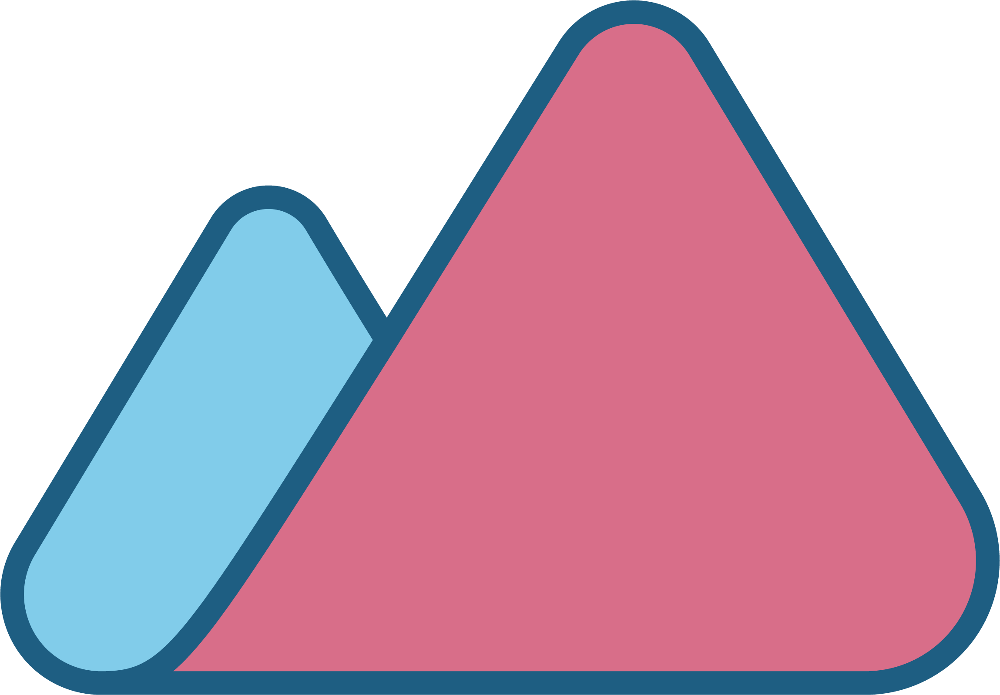

<!--MARKER-->

# whoami - Rahul

<!-- column_layout: [2, 1] -->
<!-- column: 0 -->

- Data world for 8 years
- Data Products End to End

Senior Data Engineer @MG


<!-- pause -->
<!-- column: 1 -->

Things I do and like professionally

<!-- incremental_lists: false-->

- ❄️ Snowflake
- 🐍 Python
- ☁️ AWS
- 🛠️dbt
- Terraform
- GitHub
- ❤️ PostGreSQL

<!-- pause -->

<!-- reset_layout -->

> All about productivity and DX

---

# Cute Dogos

<!-- column_layout: [2, 1] -->

<!-- column: 0 -->


<!-- column: 1 -->


<!-- end_slide -->

## What is even an Iceberg?

> Simply put its just parquet files on steroids!!!


# Highlights

<!-- incremental_lists: true-->

- Its made for huge analytical table for analytical purposes.
- ACID transactions
- Allows for Schema Evolution
- Partition management
- Time travel and rollback
- Data Compaction
- Binary format

<!-- pause -->

<!-- end_slide -->

## Engine

> Always need a engine to work with Iceberg table, can't simply just open the file.

- Spark is the recommended engine from Iceberg
- Snowflake is a working partner

## Core Concept - Catalogs

This enables all the cool iceberg stuff

- Glue catalog
- Apache Polaris Open Catalog

### How does the Catalog work

- Tracks all the changes in the metadata of iceberg

<!-- end_slide -->

## Code example

Snowflake Code

```snow +exec

select date as product_date,
product_line as line from CORTEX_ANALYST_DEMO.REVENUE_TIMESERIES.DAILY_REVENUE_BY_PRODUCT
limit 10;
```
